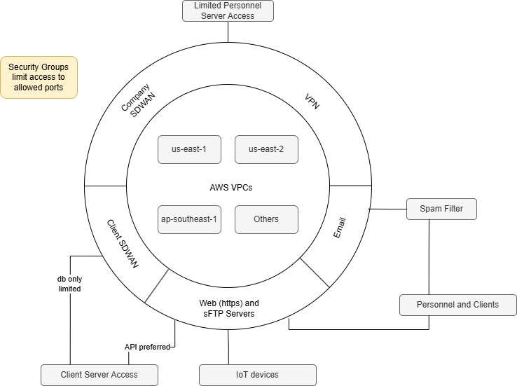
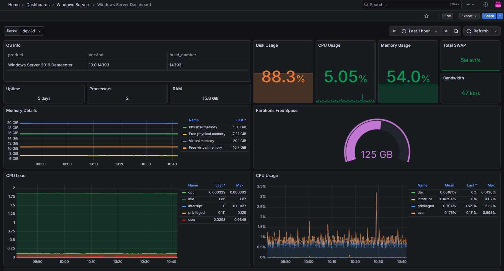
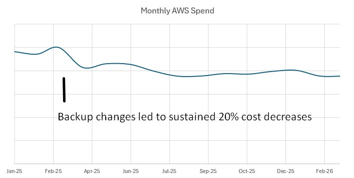

# Moving a SaaS Company to the Cloud and Keeping It Secure

## Sixty Servers, Three Months, One Server at a Time

A laboratory software company had spent years running its SaaS platform out of a traditional data center. The client list spanned pharma labs, clinical diagnostics, oil and used-oil testing, electrical engineering firms, precious metals manufacturing, agricultural and water quality labs, medical examiners, and more. All of them depended on the platform being available, secure, and compliant, often under strict regulatory requirements.

When it came time to migrate to AWS, I moved them there.

Over roughly two months, I migrated approximately 60 to 80 production servers into AWS. Each client environment had its own dependencies — different database versions, application configurations, integration points, and compliance needs. There was no one-size-fits-all playbook. Every server got its own project plan. File synchronization tools like Syncthing kept data current during transition windows, and cutovers were coordinated individually so that the vast majority of clients experienced no downtime at all. Out of the entire migration, only two clients encountered minor issues, both resolved quickly.

The migration itself also became an opportunity to raise the bar. Older servers were upgraded, TLS 1.2 was enforced across the board, and security groups were configured from scratch for the new environment.

---

## From Engineer to CTO: Owning the Security Program

Not long after the migration, my role expanded to CTO and Information Security Officer. The infrastructure I had just migrated was now mine to protect. The company needed to pass a NIST 800-53 v4 security audit, a framework with 18 security categories.

I designed and implemented the security program from the ground up: standard operating procedures, environment hardening, access policies, and incident response planning. Under my guidance, third-party auditors consistently found the environment in compliance.

Some of the hardest problems weren't infrastructure problems at all:

**Code needed attention.** Multiple codebases required review and, in some cases, refactoring. Sensitive information had to be kept out of repositories. Legacy code had to be updated so that modern TLS requirements could be enforced. Penetration testing drove several of these improvements.

**Observability had to grow up.** A SaaS environment serving laboratories across regulated industries can't afford blind spots. I and my team significantly expanded the monitoring and alerting program to include Grafana and Prometheus dashboards, SQL Server alerting, custom uptime monitoring tools, OpenSearch for email log analysis, automated AlienVault SIEM reporting through a managed security services provider, and CloudWatch alarms.

**People were the biggest variable.** The tooling is, in some ways, the easier part. Training every team member on security practices — and then verifying those practices were followed — was an ongoing effort. A comprehensive security program lives or dies on the people responsible for it. Documentation, training, and culture matter as much as any firewall rule.

---

## Building a Self-Service Operations Platform

Only two people had direct access to the AWS environment: myself and a DevOps engineer. That was deliberate. Fewer hands in the console means a smaller attack surface and cleaner audit trails.

But the rest of the operations team still needed to do their jobs. A Python and Vue.js web application integrated with the company's SAML-based single sign-on was used to provide the necessary functionality. Through this tool, authorized team members could:

- **Provision and manage infrastructure** — spin up new servers, IIS sites, and Docker environments
- **Manage DNS** — create and update Route 53 records
- **Coordinate deployments** — integrated with Ansible and web APIs for configuration management
- **Monitor systems** — track uptime, view backup status, and manage uptime alerts
- **Handle identity** — manage LDAP and SAML SSO services
- **Rotate credentials** — CLI integration with LastPass for password rotations

The platform gave the team the capabilities they needed without giving them the keys to the kingdom. Security and access controls scaled with the team, not against it.

---

## Controlling AWS Costs Over the Long Haul

Cloud migrations often come with a honeymoon period followed by a slowly climbing bill. I managed AWS spending for several years, and it was never a set-and-forget exercise.

Routine audits reviewed instance sizing and utilization. Underused resources were rightsized or eliminated. The biggest cost reduction came from rethinking backups. The existing R1Soft-based backup system was replaced with AWS-native solutions. The result wasn't just a vendor swap — recovery time objectives improved dramatically (from months to hours in a worst-case disaster scenario). The change reduced overall AWS costs by 20%.

---

## What This Work Looked Like in Practice

**Architecture diagram**

**Grafana dashboard screenshot**

**Before-and-after cost chart**

---

## The Bigger Picture

This was less of a singular project and more of an ongoing responsibility — keeping a multi-tenant SaaS platform secure, observable, cost-effective, and reliable for laboratories where data integrity isn't just a nice-to-have. In many of these industries, the data in the system ends up in regulatory filings, court testimony, or patient records.

The technology stack matters, but only in service of the outcome: clients who trust that their data is safe, their systems are available, and someone is paying attention.

**Key technologies:** AWS (EC2, VPC, Route 53, CloudWatch, S3), Grafana, Prometheus, OpenSearch, AlienVault SIEM, Ansible, Python, Vue.js, SAML SSO, LDAP, Docker, SQL Server, Syncthing, Eramba GRC
