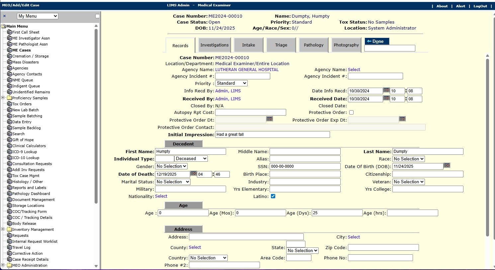

# Medical Examiner Office Information System

**Document Type:** Portfolio Case Study  
**Author:** Jeremy Dowling  
**Date:** April 23, 2026  
**Role:** Lead Developer & Project Manager

---

## Summary

Built a new module for the LabLynx LIMS (Laboratory Information Management System) to handle information management for the second largest Medical Examiner in the US, which remains in use to this day. Other state and county organizations have since adopted this software. All departments in the Medical Examiner office utilize the software — intake, investigations, medical records, X-Ray techs, pathology, tox lab, photography, etc.

The system includes full auditing and electronic signatures, and is routinely used in court proceedings. I handled all aspects of the project, including implementation, project management, design, requirements gathering, and the majority of development work. An independent web portal allows the public to make information requests. Automated features were implemented to support sub-contracted testing, including HL7 data exchange.

The go-live process included on-site training and manuals tailored to the Medical Examiner's processes.

---

## Key Accomplishments

- Replaced a paper-based system — where some data was transcribed to a mainframe — with a fully electronic solution.
- Migrated historical mainframe data going back to 1980 into the new software.
- The Medical Examiner successfully demonstrated NAMEC and ISO compliance.
- Automated HL7-based data and report exchange for sub-contracted testing.
- Delivered a variety of worklists to facilitate status and prioritization tracking across all departments.

---

## Technology Stack

### Core Platform

| Component | Technology |
|-----------|-----------|
| LIMS Platform | LabLynx LIMS (custom module) |
| Database | SQL Server |
| Web Server | IIS |
| Backend | ASP.NET, C# |
| Frontend | JavaScript, HTML |
| Reporting | GrapeCity ActiveReports |

### Automation & Integration

| Component | Technology |
|-----------|-----------|
| Scripting | Java, RhinoScript, JavaScript |
| HL7 Integration | Mirth Connect |
| Workflow Automation | Node-RED |

---

## Screenshots

