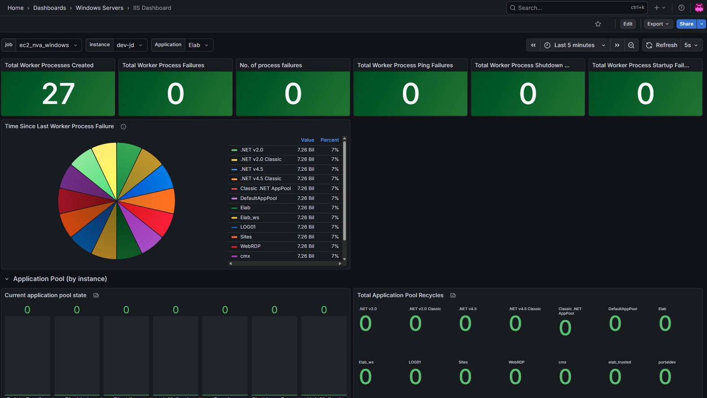
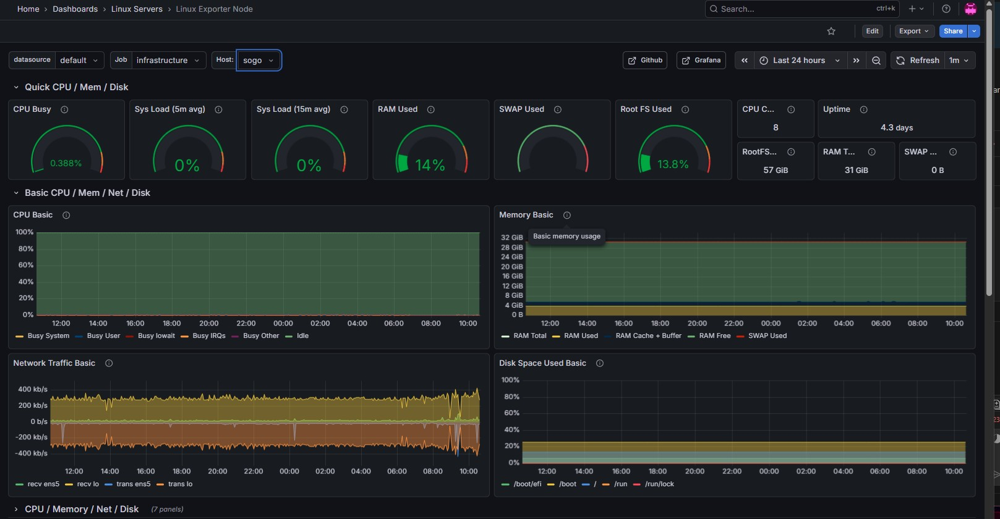
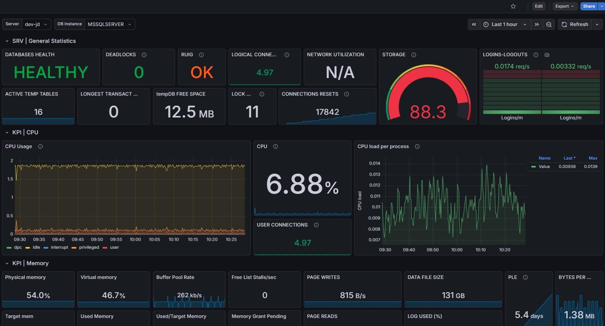

# Enterprise Monitoring Solution: From Reactive to Proactive Operations

When I became CTO in 2018, our SaaS company's ~200 servers alerting and monitoring existed through fragmented, custom alerting systems, and generally lacked visibility. Important information, such as system performance was not readily available. I implemented a dockerized Grafana/Prometheus monitoring solution that transformed how we understood and managed our infrastructure.

## The Solution

Deployed comprehensive monitoring across 50 Windows and 150 Linux servers. Most Linux systems were primarily Docker Swarm hosting isolated customer applications. Most Windows servers hosted IIS and/or SQL Server. The platform captured system metrics (CPU, memory, disk), application-specific data (IIS, SQL Server, Docker), quality metrics (CAPA), and business KPIs — all visualized through role-based dashboards integrated with company SSO.

## Impact

The results were dramatic:
- **5-10X reduction in customer-facing emergencies** through early problem detection
- **Proactive issue resolution** before customers were affected
- **Faster incident response** as client-facing teams could quickly identify root causes and engage the right resources
- **Continuous improvement** enabled by trending data that highlighted areas needing attention
- **Observable quality improvements** in both software and hosting operations

By democratizing access to operational data beyond DevOps — giving visibility to quality, business, and support teams — we shifted from reactive firefighting to strategic, data-driven operations management.

