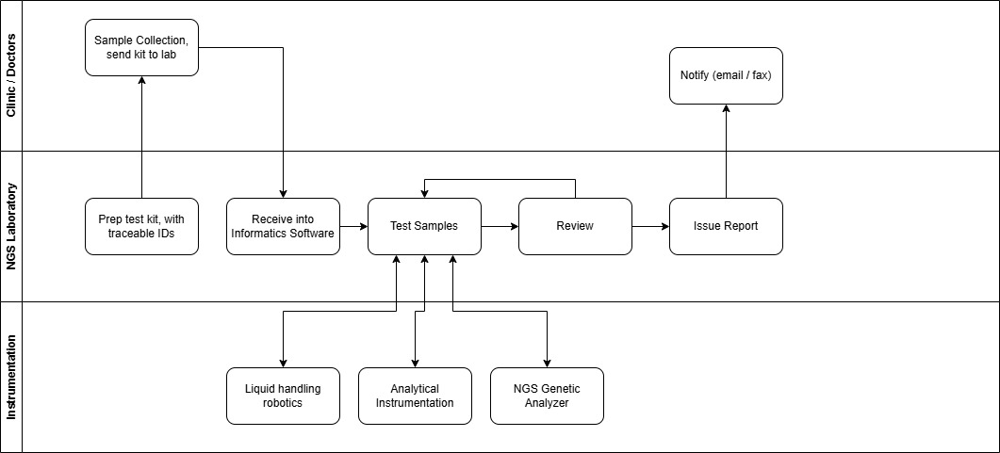
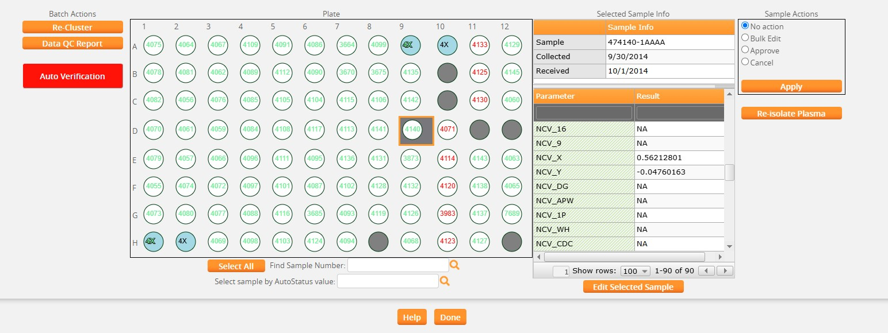

The growth of a clinical genetics lab that was ultimately processing nearly a thousand patient samples every day needed software that could facilitate operational scaling. Getting them from a barcode scan in receiving to a result in a physician's hands involves liquid handling robots, a next-generation genetic sequencer, quality control checks, storage, results and report review, and a regulatory framework that ensures data integrity. Laboratories like this have a lot of complexity, and a lot of opportunity for mistakes, and so benefit a lot from automation.

(NGS = Next Generation Sequencing)

## From Research to Large-Scale Clinical Operation

The methodology that started the lab grew out of a college research project. A novel genetic testing methodology emerged from that work and turned out to be commercially viable. One of the first formal software investments as the business took shape was a laboratory information management system (LIMS), to track samples and orchestrate the workflow from intake to result.

The lab grew, and then it was acquired multiple times. Each transition brought more samples, more clinicians ordering tests, more regulatory complexity, more expectations from the parent organization. A specialized workflow became a high-volume clinical operation. The LIMS was the informatics software at the core - it, and the software built around it had to keep pace.

## How I Got Involved

Before this engagement, I had done optimization work on the LIMS. Performance tuning on a customized system with unique workflows. The lab was happy with those successes, but wanted more. Through the LIMS vendor, they brought me in at roughly three-quarters of my time for about two years. My background helped: fifteen years in pharma analytical labs before I moved into software meant I was already familiar with the science and regulatory compliance requirements. I knew the LIMS and I understood the workflows.

## The Work

The engagement touched every major part of the workflow. Some of it was building integrations. Some was extending or improving on what already existed. The goal was to reduce manual handling, help users focus on their responsibilities, and maintain regulatory compliance with audit trails, and the various other data integrity controls that come with that.

### Instrument Interfacing

Sample preparation in an NGS workflow is a series of physical operations — DNA extraction, isolation, library preparation, amplification, pooling. These steps typically happen on 96-well and 384-well plates. In this workflow Hamilton liquid handling robots were used with those plates. Getting those robots and the LIMS into a genuine bidirectional conversation was a critical step in automation. A human had to get the samples to the robot, but once there, barcodes and automation eliminate brute-force data entry. 

The earlier robot models communicated via file exchange. A lab technician would scan samples to start a batch. The LIMS would write a structured file with sample IDs and batch parameters. The robot would read it, run its protocol, and write a completion file back. Later models moved to web APIs, which is the same logic over a different protocol. What mattered in both cases was that sample identifiers carried forward without error through the various sequential steps. 

UV spectrophotometry instruments worked the same way: LIMS sends work, instrument reports back.

The Illumina NGS genetic analyzer is where the pooling step is needed. NGS sequencing runs many samples in parallel by loading them onto a single flow cell. For that to function, each sample gets a unique molecular barcode added during library preparation, so the analyzer's software can sort everything back to its source. The LIMS sent sample and batch information to the analyzer ahead of each run. The instrument processed the pool, and the analysis software demultiplexed the output, disaggregating raw sequence data into per-sample genetic results. Those results came back into the LIMS, for final review and reporting.

### Result Quality

Control samples are included and tracked at each step, and used with features in the LIMS to help to identify problems at each step in the batching workflow. Between the preparation steps such as library prep, pooling and others, an analyst could review data in the LIMS that came from the Hamilton robots to quickly identify problems. Automation allowed analysts to focus on analyzing, rather than data entry. If a sample was invalid, or needed to be reanalyzed, or was suspicious in some manner, the LIMS would highlight it for review. With a press of a button, the analyst could take appropriate action or approve the batch for the next step.

Hard-coding scientific rules into software would be a naive approach, subject to changing as the methodology changes, or when new test methods were added. The LIMS had the right building blocks: versionable tests, configurable limits, status flags, and data-driven comparisons that could be tuned to match the lab's procedures. Using those features to evaluate batch data highlighted problematic samples with a glance. The science stayed with the scientists. My work involved rebuilding the batching and results entry UI and adding targeted data-driven features where the standard toolset needed to be extended. This work streamlined the workflow for analysts moving through batch reviews to optimize the user experience relative to lab operations. The image below shows how color coding is used to draw the eye.

### Report Review

Before a report leaves the lab it has to be approved. In this regulated clinical environment that approval belonged to a medical director. At nearly a thousand samples a day with a complicated genetics analysis report approval can become a serious bottleneck.

A colleague had sat down with the medical directors and systematically captured their decision criteria. What makes a report straightforward enough to issue without further review? What flags it for a closer look? That knowledge was codified into a Java-based expert system, loaded as a module into Mirth Connect and used to evaluate incoming reports automatically. Around 90% cleared the criteria and were auto-issued. The remaining 10% were routed to the medical directors for human review. Their attention stayed focused where it was needed, rather than being distributed across every report in the queue.

I assisted with the Mirth integrations and the UI for the report approval workflow. The expert knowledge belonged to the medical directors and to the colleague who captured it. My contributions helped make the automated decisions visible and operational at scale.

### Report Delivery

When analysis was complete and reports had cleared review, they needed to reach the ordering physicians. Not all physicians used the same channel.

For physicians who retrieved results through the lab's web portal, a notification email went out once the report reviews were completed. The results themselves weren't in the email. HIPAA compliance means patient data travels through controlled, audited channels. The email pointed physicians to the portal.

For physicians who preferred fax (and in clinical medicine, fax is still a thing), a secure fax went out via web API to an HIPAA-compliant fax provider. Same trigger logic: analysis complete, review status met, notification fires, delivery method pulled from physician preference. The system handled the routing.

### Salesforce Sync

While the lab used the LIMS, the sales team ran on Salesforce. Without some management, preferably automated, data for two systems in this situation will drift. Client records that do not align, order counts that are different, account histories that need to be manually reconciled. Incorrect data can quickly become operationally annoying, or worse, result in poor patient-related decisions.

A bidirectional integration kept them synchronized. Client and submitter records moved both ways. Accession and order data fed from the LIMS back into Salesforce automatically. The support team could answer account questions without querying the lab system directly. The sales team had current order volume data without depending on lab staff to pull reports.

### The Database

The integration work was just one component of an effective system. The lab analysis UI and the database underneath it mattered just as much, and both continued from earlier performance tuning. Performance problems are productivity killers that erode a user's confidence. Queries flagged through monitoring were addressed methodically until the database was running lean.

Performance tuning is rarely solved by finding a single "smoking gun." It's great when it is, but the process is usually iterative. As the worst offenders are resolved, smaller problems become evident as the noise is removed. Improvement opportunities can be wide-ranging. Queries written in a way that forced full table scans or that ignored indexes or that ran queries for each row when a proper join would result in a single query. Missing indexes due to the way the system is used. Query locks or deadlocking scenarios. Poorly thought out transactions when processing large amounts of data. The list is long. Optimization opportunities are not always purely query optimization in the database - sometimes the application logic or UI needs to help users focus on performant choices.

An application that creates workarounds creates data quality problems. A database sits at the center of most applications, and can not be a second-class citizen in the production tech stack. The UI and SQL work were the same job as the integrations, just internal to the application rather than an extension of it.

## Mission Accomplished

The lab is still on the same LIMS after around 13 years of continued use; a metric that speaks for itself. Through the growth, through the acquisitions, through the transition from a small research operation to a high-volume regulated clinical laboratory.

Volume grew, while headcount didn't have to grow proportionally. The clerical work that used to require people was handled by the system. That's a huge success and achieves the project objectives, but in many ways, it's not the biggest win.

More important is quality. In a clinical laboratory quality can be everything. This is a healthcare information system. A sample ID transposed between two robots, a suspicious result that slips through, a report that reaches the wrong physician — these are not inconveniences, they are patient risk. A complicated genetic methodology raises the stakes further, because there are more steps where an error can hide and fewer people equipped to catch it. Clinics ordering these tests are depending on the most accurate answer the lab can produce.

Automation and an intuitive, effective UI, improve that answer out of proportion to the labor it saves, because of where it points human attention. When the routine data carries itself without error through all steps in the workflow, and the system highlights the samples that are invalid, suspicious, or borderline, scientists are able to focus on exactly those cases. The medical directors review the ten percent of reports that genuinely need a decision instead of rubber-stamping the ninety that don't. Taking the experts off the tedium of data entry and the easy, obvious data, and putting them in front of the data that actually needs judgment is where the quality gain compounds. 

## Job Expertise

Laboratory software integration, especially in a regulated environment, is a domain problem before it's a technology problem. Knowing Mirth, knowing HL7 and HIPAA, knowing how to read a SQL Server execution plan — all necessary. But these are just the technology side of the problem.

The reason a batch completion check works the way it does isn't written in the spec. It's in the science. Knowing what a Hamilton robot is physically doing with a 96-well plate, and why that step sequence is what it is, is not context most developers arrive with. Nor is an understanding of the science in sequencing, or in how NGS analyzers produce results. This domain knowledge informs and facilitates improvements such as integrations to best fit the workflow.

**Tech stack:** Web based LIMS-centered clinical NGS workflow integrating Hamilton liquid handlers, Illumina sequencers, and UV spectrophotometers via file/API exchange, a Mirth Connect + Java expert-system layer for automated report triage, HL7-style interfacing, bidirectional Salesforce sync, HIPAA-compliant fax/portal delivery, and SQL Server performance tuning.
