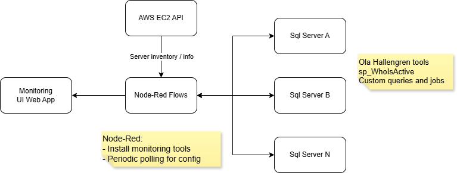
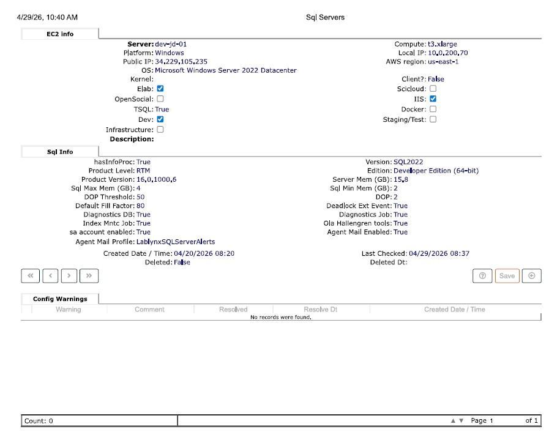
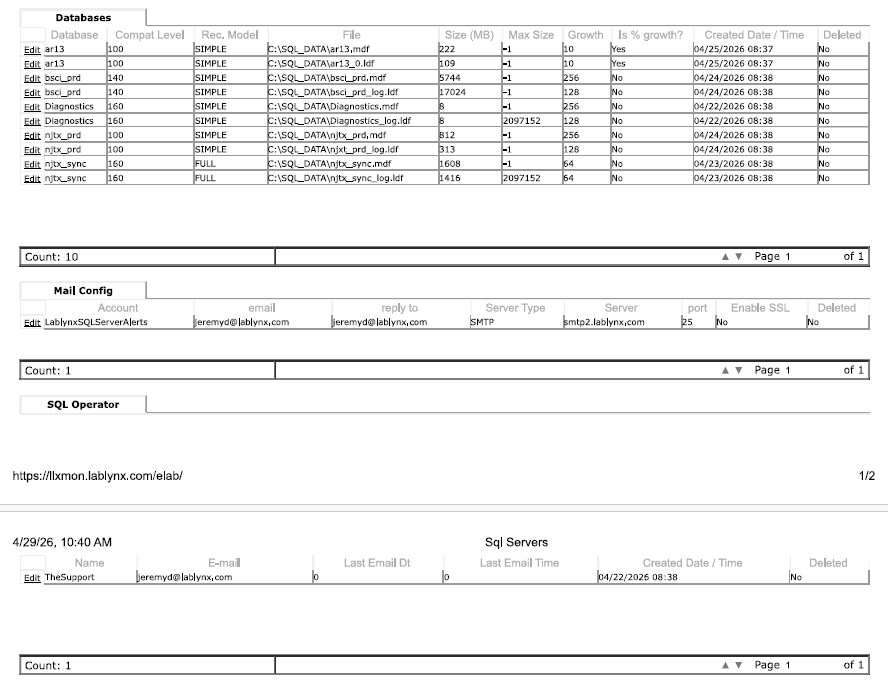
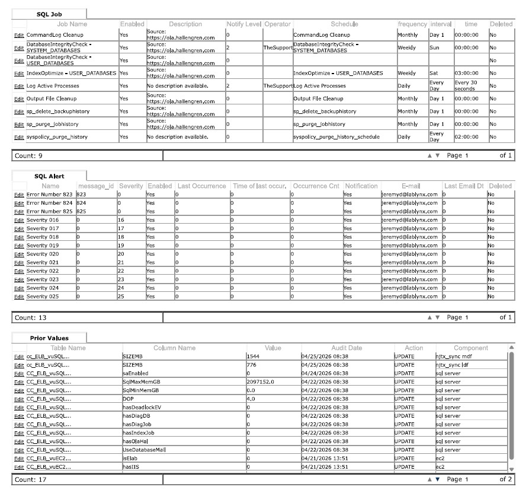

There is a particular kind of busy that laboratories run on. Samples arrive, tests are assigned, results move through approval chains, and reports have to reach clients before deadlines that do not move for anyone. Like many other industries, software isn't a convenience — it's the chain of custody, the audit trail, the thing that connects the bench to the bill. When it slows down, the lab slows down.

The platform in question was a LIMS (Laboratory Information Management System) running across roughly fifty SQL Server instances, hosting isolated databases for around eighty client laboratories. Some clients had dedicated servers; others shared infrastructure with logical separation enforced at the database level. Clinical labs, environmental testing, food safety, pharmaceutical, medical Examiners  — each with their own data volumes, their own customizations, their own growth curves. All of them depending on the database performing well. Quietly. Every day.

The challenge with such a fleet isn't any single database. It's that every database develops a different sets of habits.

---

## Flying Blind at Database Altitude

Before a proper monitoring strategy existed, performance problems followed a predictable arc. A user would notice something felt slow. A support ticket - often an emergency - would arrive. Someone would investigate, without little go on. The reflexive answer was vertical scaling — give the server more CPU and RAM, see if that quiets the complaint.

Sometimes it did. Sometimes it bought a few weeks before the same symptoms returned with a larger audience.

The thing about throwing hardware at a software problem is that it is a pain reliever, not a diagnosis. You've silenced the complaint without understanding the cause. In a multi-tenant environment where each client's database was growing at its own pace, and each lab had customized the platform to fit its own workflows , "add more server" is an expensive prescription that doesn't scale well and more importantly, is often little more than a temporary bandaid.

What was needed was a system that *paid attention*.

---

## Building the Watchtower

The monitoring architecture that emerged — refined over nearly a decade, with the current iteration running about four years — combines established industry tools with custom-built components designed to answer questions that off-the-shelf solutions couldn't quite ask.

At the foundation:

**Ola Hallengren's SQL Server Maintenance Solution** handles scheduled index rebuilds and database integrity checks across the fleet. Think of it as the database equivalent of a good dentist: nobody thinks about it while it's working, and everyone is very glad someone was regular about appointments when it's not.

**sp_WhoIsActive** provides real-time visibility into what SQL Server is actually executing at any given moment — not what it *has* executed, but what it's *doing right now*.

**SQL Server's own DMVs, wait statistics, and Extended Events** capture deadlocks, query plan data, index recommendations, and aggregate execution costs for deeper post-hoc analysis.

**A custom diagnostics database** runs a SQL Agent job collecting activity snapshots every thirty seconds. This is the piece that fills the gap the standard tools leave open. Query statistics tell you what has been expensive in aggregate — the crime report after the fact. A 30-second snapshot tells you what a real user was doing at the exact moment the server got busy — the security camera at the moment of the incident. When a user logs a ticket saying "it was slow around 10am," the snapshot history gives you something concrete to correlate, cross-referenced against IIS request logs and server-level CPU metrics.

**Node-RED flows** handle orchestration: pulling the current EC2 server list from the AWS API daily, keeping the monitoring inventory automatically synchronized with the actual fleet. New servers appear in the monitoring view without manual registration; decommissioned ones don't linger on the dashboard.



*The architecture: AWS provides the fleet inventory, Node-RED routes the daily polling and database-side configuration, the diagnostics database captures the activity history, and a web application surfaces everything for the operations team.*

All of this feeds into a custom monitoring web application — a purpose-built interface that gives the operations team a single view of every server in the fleet.



*The per-server view: EC2 metadata on top (instance type, OS, region, which services are running), followed by a SQL configuration panel that verifies every policy setting — memory limits, DOP, fill factor, deadlock event tracking, the diagnostics job, Ola Hallengren tools, agent mail. The "Config Warnings" section at the bottom surfaces any server that has drifted from the standard. This one is clean.*

The database inventory section gives a ground-level view of every database on the server — sizes, recovery models, file paths, and growth settings — all in one place, without needing to log into each instance individually.



*Every database on the server, enumerated: compatibility level, recovery model, file locations, current size, and configured growth increments. Mail configuration and alert operator wiring are verified in the same view.*

---

## The Configuration Audit

Fifty servers built up over time, onboarded at different moments under different pressures, tend to accumulate a certain kind of technical debt: default settings that were never revisited.

A SQL Server running out of the box needs to be tuned. It will use as much memory as it can reach. It will sometimes throw every available core at a single query and leave the next one waiting. It won't warn you when an index has quietly fragmented itself into uselessness over six months of inserts and deletes. And it won't tell you when a deadlock pattern starts appearing regularly.

A formal configuration policy set — documented, deployed across the fleet, and used as the basis for developer team training — addressed the patterns that kept recurring:

- **Memory limits**: SQL Server, unconstrained, will consume available RAM until the host OS starts losing its composure. A sensible ceiling keeps the server predictable and the host functional.
- **Parallelism (MaxDOP)**: Left at defaults, SQL Server will sometimes route an entire query through every available core, leaving concurrent queries queued. On shared servers hosting multiple client databases, tuning this has an outsized effect on consistency.
- **Integrity checks**: DBCC CHECKDB almost never finds corruption. "Almost never" is cold comfort the day it does, and you have no record of the last check.
- **Index maintenance**: Fragmentation accumulates silently. The index is still there — it just stops being useful. Regular rebuilds keep it honest.
- **Alerting**: SQL Server Agent jobs were configured to notify on failure, giving the operations team visibility into problems that had previously persisted silently.

The policy document also created a shared baseline: when a new server was stood up, there was a checklist to follow rather than a memory to rely on.

One detail that tends to land well with anyone who has dealt with a compliance audit: the monitoring application automatically logs every configuration change to a Prior Values table — timestamped, with the old and new values recorded. When sa gets disabled, when MaxMem gets adjusted, when DOP is tuned — it's all in the log. Not because anyone was manually keeping records; the system was doing it automatically.



*SQL Agent jobs, alert definitions, and — at the bottom — the configuration audit trail. Every policy-relevant change to any tracked server is recorded automatically: what changed, when, and from what value. No manual logging required.*

---

## Finding the Slow Queries: Where the Real Work Lives

The monitoring infrastructure is what makes targeted query optimization possible. Without visibility into *where* the time is actually going, optimization is guesswork. With it, the work becomes surgical.

The patterns that surfaced most consistently across client codebases — each representing a category of fix that appeared dozens or hundreds of times across the fleet:

**Functions in WHERE clauses.** SQL Server can use an index efficiently only when a WHERE clause is written in a way the query optimizer can match against it. Wrapping a column in a function call — even a small, well-intentioned user-defined function — effectively removes the index from consideration. The database is forced to scan the entire table, calling the function on every row. At small data volumes, this is invisible. As data grows, it becomes a wall.

Here's a real example, anonymized. A stored procedure responsible for loading test result data for a laboratory processing batch included a user-approval check embedded in the WHERE clause:

```sql
-- Before: approval function evaluated for every row in the table
WHERE dbo.udfGET_UserApprovalPriorSTRPr(
        strp.SAMPLEID, strp.TESTID, strp.RUNID,
        strp.PROCESSID, ISNULL(@USERID, -1)
    ) = 0
```

The fix: understand what the function actually checks — it evaluates a path/process approval relationship — then expose that relationship as a join. The UDF is called only for the minority of rows where the join indicates it might be necessary:

```sql
-- After: join surfaces the data first; UDF called only for edge cases
INNER JOIN dbo.PATHPROCESSES pp
    ON pp.PROCESSID = strp.PROCESSID
    AND pp.PATHID = t.PATHID
WHERE (
    ISNULL(pp.PATHPROCESSESALTUSER, 0) = 0   -- handles the vast majority of rows
    OR dbo.udfGET_UserApprovalPriorSTRPr(...) = 0  -- UDF only when genuinely needed
)
```

One structural change. The function goes from running against every row to running against a small fraction of them.

**Over-broad views.** A view that joins six tables to produce twenty columns is expensive when every caller actually uses three of them. In a codebase where views are reused heavily for consistency, the cost is real and invisible — each caller assumes the view is cheap because it looks like a simple SELECT.

**Unnecessary DISTINCT.** DISTINCT is sometimes the right tool. More often, it's covering for a join that produces duplicates because it's joining at the wrong grain. Fixing the join eliminates the duplicates without the full-sort that DISTINCT implies.

**Cursor patterns where set-based logic would do.** SQL Server is built around operating on sets of data. Cursors — loops that process one row at a time — have legitimate uses, but in a codebase with a lot of application-side developers who learned SQL as a secondary skill, they often appeared where a well-structured query would process the same work in a fraction of the time.

Across client codebases that had been customized and extended over years, the total count of improvements identified and applied ran into the thousands. Not every change was dramatic individually. Cumulatively, they changed how the application felt to the people using it. Clients who had been bumping against performance ceilings as their data grew found they had more headroom than expected. Support ticket volume for performance complaints came down. Vertical scaling moved from the first reflex to the last resort.

---

## What This Looks Like From the Outside

For clients, the experience was straightforward: things got faster, and stayed that way. The lab software they depended on handled their growing sample volume without the slowdowns that had previously meant pausing workflows, waiting for page loads, or calling support. For labs where turnaround time is a business metric — and it usually is — that's a direct operational improvement.

For the operations team, the monitoring system meant problems could be found rather than reported. A performance pattern visible in the dashboard before any user noticed is a problem that gets resolved before it becomes a ticket. A memory configuration running too close to the limit is a configuration change, not an incident.
