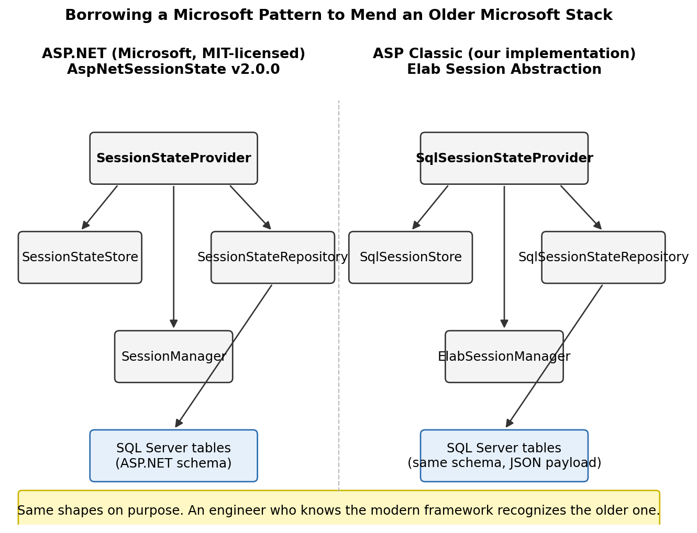
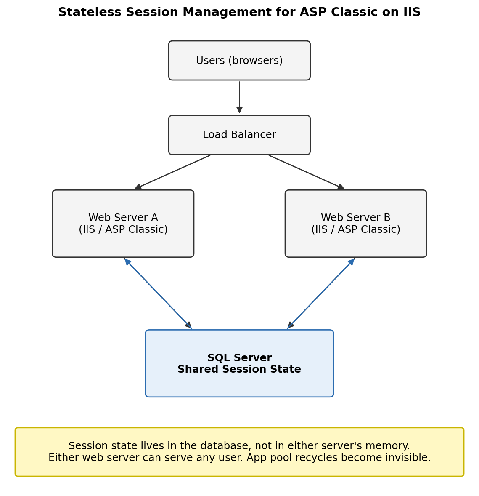

# Teaching an Old Application to Remember

A user's session is the application's short-term memory. It is what tells the server *who you are*, *what you were doing*, and *whether you have permission to be doing it*. When that memory lives only inside a single web server's RAM, every restart is a small kind of amnesia. Users get thrown back to the login screen mid-task, half-written records vanish, and the helpdesk phone rings.

This is the story of pulling that memory out of one server's head and putting it somewhere safer. The fix turned out to be less about chasing a bug and more about borrowing a pattern that Microsoft itself had addressed in a newer framework, and rebuilding it for an older one.

## The Symptom and the Story Behind It

A laboratory information management system, hosted in the cloud for a single large client, had been running smoothly on the same dedicated server for over a decade. Eighty to a hundred users used it through the working day. Then, with no obvious change in inputs, the application pool started crashing. Sometimes the main application would throw 500 errors. Sometimes it was the file viewer used to look at photos. The crash often resulted in users being kicked out. They'd log back in, hope the work they were halfway through was saved.

The application was built on a much older Microsoft web stack, ASP Classic on IIS, where web sessions are kept in memory by the web server itself. There is no checkbox to move them elsewhere. When the worker process recycles, the memory goes with it. Eighty to a hundred analysts can suddenly find themselves staring at a login form they did not ask for.

## The Hunt for a Smoking Gun

We chased the cause for months. Patterns emerged and then dissolved. The crashes clustered around early-morning jobs that streamed database backups across a site-to-site VPN, which suggested disk or network pressure. But the pattern was not consistent. Sometimes the wrong application pool would fail. Sometimes it happened at three in the afternoon. A full disk check and defragmentation pass would buy weeks of calm, then the noise would creep back.

The honest conclusion, after a great deal of effort, was that the underlying operating system on a decade-old server had developed something close to a personality flaw. One that we could nudge but not name.

Tuning the application pool recycle schedule to fire right after the morning backup helped. Emergency calls dropped from once every two weeks to once or twice a quarter. The 500 errors were still in the IIS logs, but the pool would come back on its own and most users would not notice. The users who did notice were still too many. The client had begun to look at competing applications.

## Designing for the Migration That Was Coming

The recycle problem needed solving today, but it was not the only thing on the roadmap. The application's longer-term direction was a piece-by-piece migration onto newer .NET technology, using the strangler fig pattern: build the new alongside the old, redirect a page at a time, until the old has been quietly replaced. That pattern only works if both halves can share state, and the single most important piece of shared state is the user's session. An ASP Classic page and an ASP.NET page have to agree on who the user is, or every visit across the boundary becomes a second login.

ASP.NET already had a clean answer for SQL-stored session state. Microsoft ships a pluggable provider model with the newer framework, and the reference implementation is open source under the MIT license at github.com/aspnet/AspNetSessionState. A provider coordinates the work, a manager tracks per-user state, and a repository handles the database. Tables, schema, and lifecycle are all defined.

I built the same pattern for ASP Classic. Same shape, same schema, with the data on the wire serialized as JSON so that the older codebase could read and write it without dragging in the newer framework's binary formatters.

The provider is called at a handful of critical moments: when the application starts, when a web session begins, when a user logs in or out, and at the start and end of each response. The provider talks to the session manager, which tracks the state of the user's cookie and whether the in-memory session matches the database. The repository does the actual reads and writes. Errors bubble up through a dedicated stack so that an unexpected disk hiccup never silently corrupts what the user sees.

Choosing that shape was the load-bearing decision. When new .NET pages are eventually layered into the application, they will read the same session a user already established from an old page, because they speak to the same tables. The two worlds can already share a language, and were only waiting for one of them to learn how to talk. As a useful side effect, an application that no longer stores session state in IIS memory is an application that survives a crashing worker process.

## What Changed for Users

On the old, troubled server, the change was quiet. I left the application pool recycling on an aggressive hourly schedule, but the user no longer felt the recycle. Their session was waiting in the database when the worker process came back. The 500 errors continued to show up in the logs, but they had been made invisible.

The emergency calls stopped. The client, who had been actively shopping for a replacement application, stayed. They are still an active hosting client years later.

When that client was eventually moved onto a new server with a newer operating system and a newer SQL Server version, I kept all of the same software in place. On the new server, the underlying 500 errors disappeared as well. The session abstraction was no longer covering for an aging machine. It was now doing what it had been designed to do all along: enabling the application to grow.

## A Free Capability: The Web Farm

Designing for shared session state across frameworks also meant designing for shared session state across servers. ASP Classic on IIS, without intervention, ties each user to whichever server holds their session in memory. Put two servers behind a load balancer and the second server has no idea who the user is. Move the session to the database, give each server a unique identifier in configuration, and the load balancer is free to send a request to either one. High availability stops being a wish.

## The Shape of the Work

The work was small in footprint and large in intent. Before writing code, I mapped out the full suite of behaviors in a scenario table, covering the slightly unsettling number of ways a user can come and go from a web application. Login. Logout. Browser close. Idle timeout. Application pool recycle while logged in. Application pool recycle with multiple users active. The table also serves as a regression test guide for any future change to the code.

The class layout mirrors the open-source ASP.NET implementation closely enough that an engineer familiar with the newer framework can read the older code and recognize where they are. Provider, store, manager, repository, command helper, parameter collection. The names are the same on purpose.

## The Quiet Kind of Win

The best fixes are the ones the users never see. A login screen that does not appear. A reconnection that does not happen. A morning of analytical work that does not get interrupted because somewhere, deep in the rack, a worker process recycled and came back without saying anything to anyone.

That is what this work was, and it is also what it enabled. A small architectural change, modeled on patterns that the broader Microsoft ecosystem had already validated, that turned a decade-old application into one with room to grow.

---

**Key concepts:** session state abstraction, provider/manager/repository pattern, ASP Classic on IIS, ASP.NET session state provider model (AspNetSessionState), strangler fig migration pattern, SQL Server session storage, web farm enablement, JSON serialization for cross-framework session sharing.
